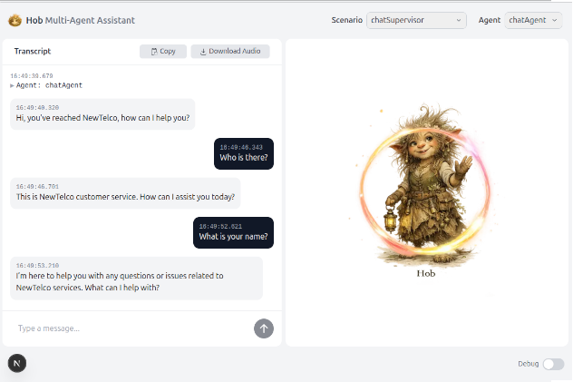

# Hob

[](LICENSE)[](FOSS_PLURALISM_MANIFESTO.md)

[](https://platform.openai.com/docs/guides/realtime)
[](https://nextjs.org)
[](https://react.dev)
[](https://www.typescriptlang.org)
[](https://nodejs.org)
[](https://tailwindcss.com)

> *Talk. Delegate. Done.*

**Hob** is a voice-first, multi-agent application built on the [OpenAI Realtime API](https://platform.openai.com/docs/guides/realtime). It supports low-latency streaming voice conversations with AI agents that can call tools, hand off between each other, and delegate complex reasoning to higher-intelligence text models — all in real time.

Hob is a fork of [OpenAI's Realtime API Agents Demo](https://github.com/openai/openai-realtime-agents), used under the MIT license and being developed into a new product in the open.


## Getting Started

### Prerequisites

- Node.js 18+
- An [OpenAI API key](https://platform.openai.com/api-keys) with Realtime API access, **or** an [Azure OpenAI](https://learn.microsoft.com/en-us/azure/ai-services/openai/) resource with Realtime API enabled

### Installation

```bash
npm install
```

### Configuration

Copy the sample env file and fill in your credentials:

```bash
cp .env.sample .env.local
```

#### Direct OpenAI (default)

```env
OPENAI_API_KEY=sk-...
```

#### Azure OpenAI

```env
LLM_PROVIDER=azure
AZURE_OPENAI_ENDPOINT=https://your-resource.openai.azure.com
AZURE_OPENAI_API_KEY=your-azure-api-key
AZURE_OPENAI_API_VERSION=2025-04-01-preview
AZURE_OPENAI_REALTIME_DEPLOYMENT=gpt-4o-realtime-preview
AZURE_OPENAI_RESPONSES_DEPLOYMENT=gpt-4.1
AZURE_OPENAI_MINI_DEPLOYMENT=gpt-4o-mini
```

#### Provider selection

The app uses a three-tier strategy to determine which provider to use:

1. **Explicit** — set `LLM_PROVIDER` to `openai` or `azure` to force a provider (useful when both sets of credentials are present)
2. **Auto-detect** — if `LLM_PROVIDER` is unset, the app checks for `OPENAI_API_KEY` first, then `AZURE_OPENAI_ENDPOINT`
3. **Fail** — if no provider can be resolved, the app throws a startup error

### Running

```bash
npm run dev
```

Open [http://localhost:3000](http://localhost:3000) in your browser. Click **Connect** to start a voice session.

---

## How It Works

Hob uses **WebRTC** to stream audio directly between the browser and the OpenAI Realtime API — the Next.js server is only involved in minting a short-lived session token. Once connected, the conversation is handled by a network of AI agents defined in `src/app/agentConfigs/`.



### Agent vs Scenario

In this repo, these are different things:

| Term | What it is | Example in code |
| ---- | ---------- | --------------- |
| **Agent** | One `RealtimeAgent` with a single role: instructions, tools, and allowed handoffs | `assistant`, `chatAgent`, `authenticationAgent` |
| **Agent scenario** | A named `RealtimeAgent[]` set that defines the team used for one session | `defaultAssistantScenario`, `chatSupervisorScenario`, `customerServiceRetailScenario`, `simpleHandoffScenario` |

Put simply:

- An **agent** is one worker.
- A **scenario** is the full team configuration and entry point you choose from the UI (`?agentConfig=<name>`).

Four built-in scenarios are currently included:

| Scenario | Description |
| -------- | ----------- |
| `defaultAssistant` *(default)* | Production-oriented single-assistant flow with hosted tools (`webSearch`, `codeInterpreter`, optional `fileSearch`) |
| `chatSupervisor` | Two-layer pattern where a realtime front agent delegates difficult responses/tool use to a stronger supervisor model |
| `customerServiceRetail` | Multi-agent retail example (authentication, returns, sales, simulated human escalation) |
| `simpleHandoff` | Minimal two-agent handoff reference for learning and debugging |

Select a scenario from the dropdown in the top bar, or pass `?agentConfig=<name>` as a URL parameter.

### DefaultAssistant

`defaultAssistant` is the current default scenario (`defaultAgentSetKey`), backed by a single `assistant` `RealtimeAgent` defined in `src/app/agentConfigs/defaultAssistant/index.ts`.

Its behavior is intentionally simple:

- General-purpose voice assistant with concise, practical replies
- Handles lightweight conversation directly
- Uses tools for facts, recent information, calculations, and code-like tasks
- Asks follow-up questions when required parameters are missing
- Does not claim tool usage unless a tool was actually called

### DefaultAssistant Tools (excluding file search)

The `defaultAssistant` tools are implemented in `src/app/agentConfigs/defaultAssistant/hostedTools.ts` using the Agents SDK `tool(...)` helper.

How tool execution works:

1. The realtime assistant decides to call a tool (`webSearch` or `codeInterpreter`) based on user intent.
2. The tool `execute(...)` handler calls a shared helper (`callResponses`) that `POST`s to `/api/responses`.
3. `/api/responses` is a server-side proxy that selects OpenAI vs Azure based on env config (`LLM_PROVIDER` + fallback logic).
4. The proxy calls the Responses API with `parallel_tool_calls: false` and the hosted tool definition for that request.
5. Tool output text is normalized by `extractOutputText(...)` and returned to the realtime agent as `{ result: "..." }`.
6. If the API call fails, the tool returns a structured error (for example `web_search_failed` or `code_interpreter_failed`) so the assistant can recover gracefully.

Tool-specific behavior:

- `webSearch` accepts a single `query` string.
- `webSearch` uses the hosted Responses tool `web_search`.
- `webSearch` prompts for an accurate, concise answer and asks for source URLs in plain text.
- `codeInterpreter` accepts a single `task` string.
- `codeInterpreter` uses the hosted Responses tool `code_interpreter` with `container: { type: "auto" }`.
- `codeInterpreter` returns concise computed or derived output from the code execution flow.

### Key Features

- **Voice or Push-to-Talk** — server-side VAD by default; PTT mode available via the toolbar
- **Multi-agent handoffs** — agents transfer the conversation context to each other seamlessly
- **Tool calling** — agents can look up data, manage carts, check policies, and more
- **Output guardrails** — every response is asynchronously checked for offensive, off-brand, or violent content
- **Audio recording** — the full conversation (both sides) can be downloaded as a WAV file
- **Developer event log** — a live panel shows every SDK and API event with expandable JSON payloads

---

## Architecture

For a full description of the system design, see [docs/hob-architecture-baseline.md](docs/hob-architecture-baseline.md).

High-level stack: **Next.js 15** · **React 19** · **TypeScript** · **OpenAI Agents SDK** · **WebRTC** · **Tailwind CSS**

## Principles of Participation

Everyone is invited and welcome to contribute: open issues, propose pull requests, share ideas, or help improve documentation.  
Participation is open to all, regardless of background or viewpoint.  

This project follows the [FOSS Pluralism Manifesto](./FOSS_PLURALISM_MANIFESTO.md),  
which affirms respect for people, freedom to critique ideas, and space for diverse perspectives.  


## License and Copyright

Copyright (c) 2025, 2026 OpenAI, Iwan van der Kleijn

This project is licensed under the MIT License. See the [LICENSE](LICENSE) file for details.
