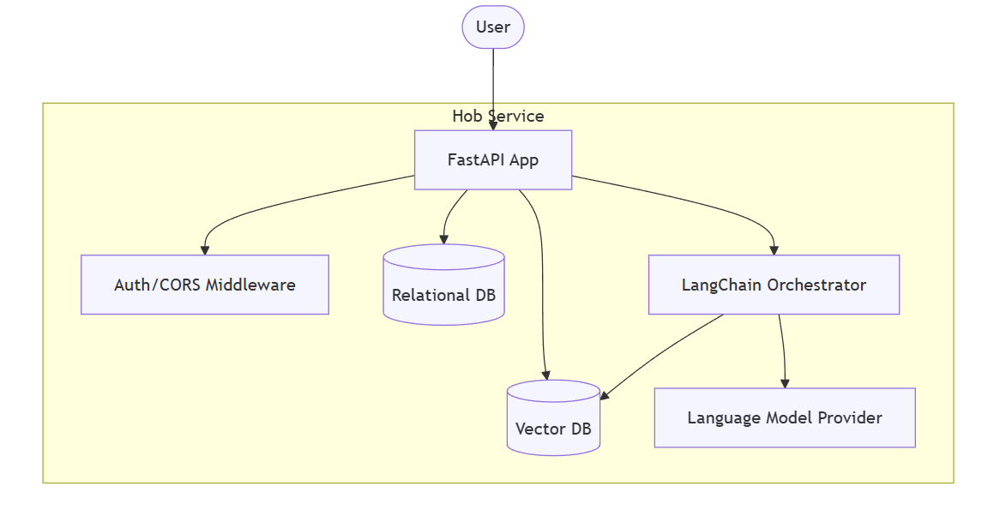

# Hob: A private AI-augmented workspace 

## A Chatbot for organizing, searching, and conversing with your private project notes and files

## Hob as a service {#hob-as-a-service}

**Mission Statement:**  
The back-end service of Hob allows authenticated users to create and manage “Bundles” of related content, including notes, uploaded files, and conversations. Hob helps the user search, organize, and discuss their stored information. It enhances these capabilities by embedding the content into a vector database for semantic search, and supports the creation of “Jobs” to bulk-ingest, store, and embed large sets of files.

**Core Concepts:**

- **User:**  
  An authorized user who can create and manage multiple Bundles.  
    
- **Bundle:**  
  A private, compound data collection that groups content.  
  Examples: “Project Alpha Notes”, “Quarterly Meeting Minutes”, “Product Roadmap Files”.  
    
  Each Bundle can contain:  
    
  - Notes (text-based, Trello-like cards).  
  - Files (Office documents, images, text files including source code, CSVs).  
  - Zipped collections of files (treated as a single “note” but with internal metadata).  
  - Conversations: Q\&A threads, discussions related to the Bundle’s content.

- **Jobs:**  
  Scheduled or on-demand processes to bulk-ingest multiple files, store them, and generate embeddings for efficient retrieval. A Job can result in multiple notes being created or updated.  
    
- **Retrieval and Conversations:**  
  The user can ask questions about the content in a Bundle. Hob uses a vector database to find relevant context from the Bundle’s embedded content and answer questions. Conversations and Q\&A are stored and searchable.

**Example Usage Scenarios:**

1. **Organizing Project Docs:**  
   A user creates a “Project Alpha” Bundle. They upload design documents, meeting notes, and source code files. Hob stores these items, extracts embeddings, and allows the user to search and retrieve relevant notes. The user can ask: “What are the main tasks in Project Alpha?” Hob fetches relevant notes and responds with a summary.  
     
2. **Meeting Notes Analysis:**  
   A user creates a “Q4 Sales Meeting” Bundle and uploads a zip file of notes and presentations. A Job is triggered to ingest and embed the data. Later, the user asks: “What were the key sales targets mentioned?” Hob retrieves and presents the answers.  
     
3. **Bulk Ingestion of Codebase:**  
   A user sets up a Job to ingest a large code repository zip file. Hob processes, stores and embeds the source code files, enabling semantic queries like “Show me the function that handles database exports” or “What is the purpose of module X?”.

**Key Functionalities:**

- Create, retrieve, update, and delete Bundles.  
- Add, retrieve, and delete notes.  
- Upload files to Bundles (treated as notes).  
- Create and monitor Jobs for bulk ingestion and embedding.  
- Query the embedded content in a Bundle’s context for Q\&A.  
- Retrieve historical Q\&A conversations stored in a Bundle.  
- Global search across all Bundles belonging to the user.  
- Basic auth for user access, CORS support, and adherence to API best practices.

## Architecture Description {#architecture-description}

**Overview:**  
Hob’s back-end uses a layered architecture. At the top, a RESTful API (FastAPI) provides endpoints to manage Bundles, notes, Jobs, and conversation queries. Underneath, a relational database (SQLite by default) stores structured metadata and content. A vector database (e.g., Chroma) stores embedded representations of the files and notes, enabling semantic search. LangChain is used as a middleware to orchestrate embeddings and retrieval logic. The system is designed to be modular and scalable, allowing the pluggable replacement of vector databases or embedding models.

**Key Architectural Components:**

- **API Layer (FastAPI):**  
  Implements HTTP endpoints for all operations (Bundles, Notes, Files, Jobs, Q\&A).  
  Handles authentication (Basic Auth) and CORS.  
    
- **Database (SQLAlchemy with SQLite):**  
  Stores user, bundle, note, file metadata, job definitions, and conversation histories.  
  Flexible to switch to another SQL-compatible store.  
    
- **Vector Database (Chroma):**  
  Stores embeddings of notes and files for retrieval.  
  Can be swapped with another vector store as needed.  
    
- **LangChain Integration:**  
  Used to orchestrate embeddings, vector store queries, and large language model calls (e.g., OpenAI).  
  Supports Retrieval Augmented Generation workflows.  
    
- **Business Logic Layer:**  
  Manages Bundle operations, file ingestion, embedding processes, and Q\&A workflow.  
  Encapsulated in services, callable from the API layer.

**Scaling and “Pluggability”:**  
While the initial deployment may use SQLite and a local vector database, the architecture is designed so these components can be replaced by scalable cloud-based services (e.g., Postgres, Pinecone, etc.) without changing core application logic.

## C4 Container Diagram (Mermaid) {#c4-container-diagram-(mermaid)}

**flowchart** TD  
    **subgraph** Hob\_Service\[Hob Service\]  
        api\[FastAPI App\]  
        auth\[Auth/CORS Middleware\]  
        db\[(Relational DB)\]  
        vecdb\[(Vector DB)\]  
        langchain\[LangChain Orchestrator\]  
        llm\[Language Model Provider\]  
         
        api **\--\>** auth  
        api **\--\>** db  
        api **\--\>** vecdb  
        api **\--\>** langchain  
        langchain **\--\>** vecdb  
        langchain **\--\>** llm  
    **end**

    user(\[User\]) **\--\>** api

## API definition: Endpoints and their Pydantic Models 

Below is a high-level API definition using Pydantic-style models. Endpoints are listed with request and response models. The code examples reflect the shape of the data; they do not show full FastAPI implementation details.

All asynchronous ingestion/embedding tasks are associated with `Job` models. Files, including zips, trigger creation of Jobs. Single-file ingestion Jobs have higher priority than bulk or zip Jobs.

**Note:** This is a conceptual specification, not a fully implemented code snippet. The models and fields can be refined as needed.

##  {#heading}

### Bundle Models {#bundle-models}

class BundleCreateRequest(BaseModel):

    name: str

    description: Optional\[str\] \= None

class BundleUpdateRequest(BaseModel):

    name: Optional\[str\] \= None

    description: Optional\[str\] \= None

class BundleResponse(BaseModel):

    id: str

    name: str

    description: Optional\[str\] \= None

    created\_at: datetime

### Conversation Models {#conversation-models}

class ConversationCreateRequest(BaseModel):

    initial\_message: str

class ConversationResponse(BaseModel):

    conversation\_id: str

    initial\_message: str

    created\_at: datetime

class MessageCreateRequest(BaseModel):

    message: str

class MessageResponse(BaseModel):

    message\_id: str

    conversation\_id: str

    message: str

    role: str  \# "user" or "system"

    created\_at: datetime

### Note Models {#note-models}

class NoteCreateRequest(BaseModel):

    title: str

    content: str

class NoteUpdateRequest(BaseModel):

    title: Optional\[str\] \= None

    content: Optional\[str\] \= None

class NoteResponse(BaseModel):

    note\_id: str

    title: str

    content: str

    created\_at: datetime

### Search Models {#search-models}

class SearchResultItem(BaseModel):

    type: str

    bundle\_id: Optional\[str\] \= None

    note\_id: Optional\[str\] \= None

    conversation\_id: Optional\[str\] \= None

    message\_id: Optional\[str\] \= None

    relevance\_score: float

### Job Models {#job-models}

class JobType(str):

    file\_ingestion \= "file\_ingestion"

    bulk\_ingestion \= "bulk\_ingestion"

class JobPriority(str):

    high \= "high"

    low \= "low"

class JobCreateRequest(BaseModel):

    type: JobType

    parameters: Dict\[str, Any\] \= {}

class JobResponse(BaseModel):

    job\_id: str

    type: JobType

    priority: JobPriority

    status: str  \# e.g., "queued", "processing", "completed", "failed"

    created\_at: datetime

    result: Optional\[Dict\[str, Any\]\] \= None

---

## Endpoints and Their Models {#endpoints-and-their-models}

### Bundles {#bundles}

**Create a Bundle**  
`POST /bundles`

- Request: `BundleCreateRequest`  
- Response: `BundleResponse`

**List Bundles**  
`GET /bundles`

- Response: `List[BundleResponse]`

**Get Bundle Metadata**  
`GET /bundles/{bundle_id}`

- Response: `BundleResponse`

**Update Bundle Metadata**  
`PATCH /bundles/{bundle_id}`

- Request: `BundleUpdateRequest`  
- Response: `BundleResponse`

**Delete Bundle**  
`DELETE /bundles/{bundle_id}`

- Response: `None`

### Conversations {#conversations}

**Initiate a Conversation in a Bundle**  
`POST /bundles/{bundle_id}/conversations`

- Request: `ConversationCreateRequest`  
- Response: `ConversationResponse`

**List Conversations in a Bundle**  
`GET /bundles/{bundle_id}/conversations`

- Response: `List[ConversationResponse]`

**Add Message to a Conversation**  
`POST /bundles/{bundle_id}/conversations/{conversation_id}/messages`

- Request: `MessageCreateRequest`  
- Response: `MessageResponse`

**Get Conversation Messages**  
`GET /bundles/{bundle_id}/conversations/{conversation_id}/messages`

- Response: `List[MessageResponse]`

### Searching {#searching}

**Search Across All Bundles**  
`GET /search?query=...`

- Response: `List[SearchResultItem]`

**Search Within a Bundle**  
`GET /bundles/{bundle_id}/search?query=...`

- Response: `List[SearchResultItem]`

### Notes {#notes}

**List Notes in a Bundle**  
`GET /bundles/{bundle_id}/notes`

- Response: `List[NoteResponse]`

**Create a Note**  
`POST /bundles/{bundle_id}/notes`

- Request: `NoteCreateRequest`  
- Response: `NoteResponse`

**Get a Note**  
`GET /bundles/{bundle_id}/notes/{note_id}`

- Response: `NoteResponse`

**Update a Note**  
`PATCH /bundles/{bundle_id}/notes/{note_id}`

- Request: `NoteUpdateRequest`  
- Response: `NoteResponse`

**Delete a Note**  
`DELETE /bundles/{bundle_id}/notes/{note_id}`

- Response: `None`

### Documents (File Ingestion) {#documents-(file-ingestion)}

**Add a Single Document to a Bundle (High Priority Job)**  
`POST /bundles/{bundle_id}/documents`

- Request: Multipart file upload (binary)  
- Response: `JobResponse` (Job created with `file_ingestion` type, high priority)

**Add a ZIP Document to a Bundle (Lower Priority Job)**  
`POST /bundles/{bundle_id}/documents/zip`

- Request: Multipart file upload (binary)  
- Response: `JobResponse` (Job created with `bulk_ingestion` type, low priority)

**Delete a Document**  
`DELETE /bundles/{bundle_id}/documents/{document_id}`

- Response: `None` (Actual removal handled asynchronously by a background task if needed)

### Jobs {#jobs}

**List Jobs**  
`GET /jobs`

- Response: `List[JobResponse]`

**Create a Job (Bulk Ingestion)**  
`POST /jobs`

- Request: `JobCreateRequest`  
- Response: `JobResponse`

**Get Job Status**  
`GET /jobs/{job_id}`

- Response: `JobResponse`

**Delete a Job**  
`DELETE /jobs/{job_id}`

- Response: `None` (Cancellation requested, effective if job is not yet completed)
